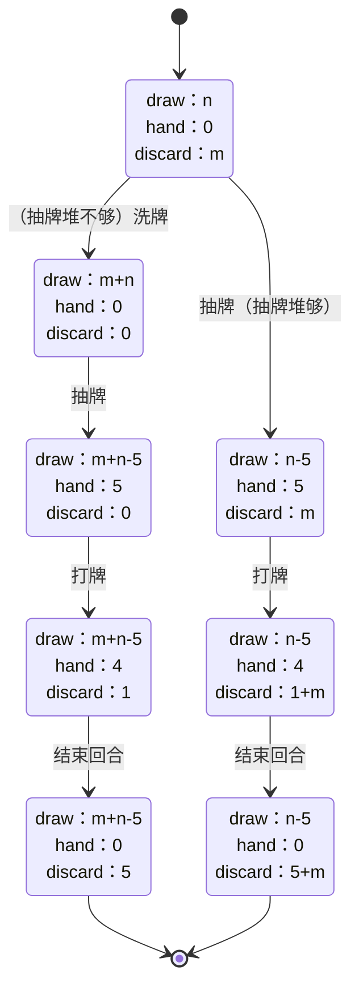

# 设计

## 核心结构体
```go
type Character struct {
	Name         string
	Energy       int
	AllCards     []Card
	DrawCards    []Card
	DiscardCards []Card
	HandCards    []Card
	Lotions      []Lotion
	Props        []Prop
}
```


## 状态图



<!-- # character
1、good
2、bad： level1、2、3
同一个结构体，
```
type struct Person {
    Name string
    Health int
    BaseAttack int
    BaseDefence int
    Weapon WeaponS
    Armor ArmorS
    Props PropsS
}
```

# action
combat
1、good act
1.1、props active
1.2、good.attack vs bad.defence
1.3、good.health
2、bad act
2.1、props active（nil）
2.2、bad.attack vs good.defence
2.3、bad.health
以上为for循环。  结束后，成功，触发 随机物品掉落（属性、weapon、armor、props）

# progress
0、init good
1、random gen bad
2、combat
2.1、success -> get booty -> return 1
2.2、failed -> return 0 -->


